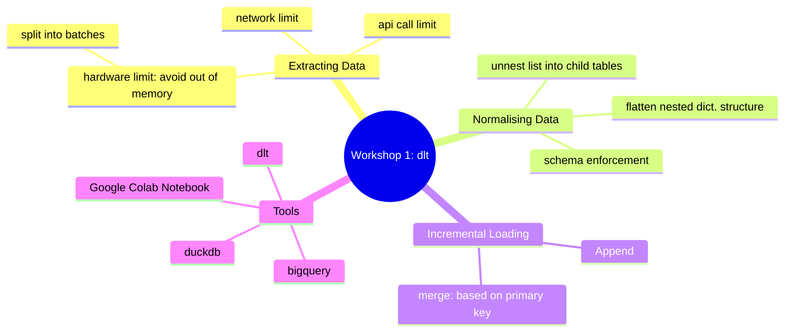

# DataEngineerZoomCamp2024Workshop1

Course Website: https://dezoomcamp.streamlit.app/Workshop%201%20Data%20Ingestion

## Data Ingestion with dlt

Workshop Recording: https://www.youtube.com/watch?v=oLXhBM7nf2Q

Ref: https://github.com/DataTalksClub/data-engineering-zoomcamp/blob/main/cohorts/2024/workshops/dlt.md

## Lesson learned

## Homework

[Colab notebook template for the homework](https://colab.research.google.com/drive/1Te-AT0lfh0GpChg1Rbd0ByEKOHYtWXfm#scrollTo=wLF4iXf-NR7t&forceEdit=true&sandboxMode=true)

[Colab Notebook with solution](https://colab.research.google.com/drive/1KtSf3BdyBayXyCuMi5YKZgi7ZBUVj6tZ?usp=sharing)

[Colab Notebook with solution exported from Colab](/DEZoomcamp2024_Workshop1_Homework_data_talks_club_data_extraction_and_ingestion.ipynb)

### Question 1: What is the sum of the outputs of the generator for limit = 5?
- **A**: 10.23433234744176
- **B**: 7.892332347441762
- ->**C**: 8.382332347441762
- **D**: 9.123332347441762

### Question 2: What is the 13th number yielded by the generator?
- **A**: 4.236551275463989
- ->**B**: 3.605551275463989
- **C**: 2.345551275463989
- **D**: 5.678551275463989

### Question 3: Append the 2 generators. After correctly appending the data, calculate the sum of all ages of people.
- ->**A**: 353
- **B**: 365
- **C**: 378
- **D**: 390

### Question 4: Merge the 2 generators using the ID column. Calculate the sum of ages of all the people loaded as described above.
- **A**: 215
- ->**B**: 266
- **C**: 241
- **D**: 258

Submit the solution here: https://courses.datatalks.club/de-zoomcamp-2024/homework/workshop1
